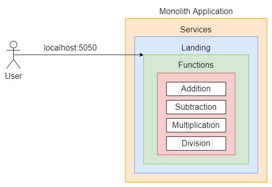

# Breaking down monoliths 🪨⛏️

This problem statement has two objectives:
- Get familiar with reading error stack trace and debugging code.
- Convert a monolith architecture based docker-compose application into a microservices based architecture.  

## Requirements:
- [docker](https://docs.docker.com/engine/) and [docker-compose](https://docs.docker.com/compose/install/). Follow the guides based on your operating system.
- Internet. Pull docker image `python:3.8-alpine` beforehand to avoid connectivity issues.

## Screenshots of Docker and Web Application

<p align="center">
  <p>Web Application Before Submit</p>
  
</p>

<p align="center">
  <p>Web Application After Submit</p>
  
  <br>
  
</p>

<p align="center">
  <p>Starting Services</p>
  
  
</p>

## Monolith architecture diagram
<p align="center">
  
</p>

## Build & Run
```
# under the microservices directory
# NOTE: For any code changes to be reflected, the build command must be rerun, and then up
docker-compose build
# run without the -d flag incase you want to observe the logs
docker-compose up -d
```
### To stop the services in detached mode
```
docker-compose down
```
## Microservices-based architecture diagram
<p align="center">
  
  
<h7 align="center">The diagram only shows the services already defined within the microservice architecture for visualization purposes. You still need to add services of your own.</h7>

</p>

## Miscellaneous
- Directory structure of additional arithmetic microservices you will be adding:
```
├── <name of the service>
│   ├── Dockerfile           # same as landing/Dockerfile
│   ├── app
│   │   ├── app.py           # TODO: by yourself
│   │   └── requirements.txt # same as landing/app/requirements.txt
│   │  
```

## Note
Since the docker services are running on the local machine, we will have to disable CORS which is enabled by default in every browser. To disable CORS in the Opera browser, run this command:
<p align="center">

</p>

